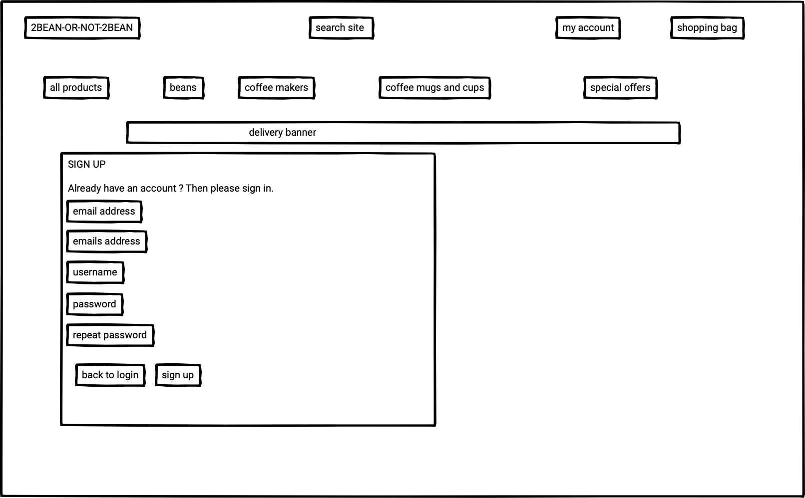

# 2Bean-or-not-2Bean

[2Bean-or-not-2Bean](https://beans2beans.herokuapp.com/) is a full stack e-commerce site aimed at the coffee enthusiast, concerned with their own health, fairtrade and the environment. This is an online only store which offers a variety of carefully selected beans(both organic and fairtrade) and quality coffee makers, cups and mugs. 
Organic is the better choice. These organic certified beans have not been treated with chemicals or toxins and as a result the coffee brew may be higher in antioxidants, vitamins, and minerals. All the beans are also fair trade certified, which means farmers who grow these beans receive a fair price, and their communities and the environment will also benefit as a result. What makes this coffee bean seller unique is that the purchaser can choose how dark they want their beans roasted, with the available options being, light, medium and dark. The purchaser can also choose to have their beans grinded with two options available, espresso and filter. As a another treat there are once-off beans which are less known or rare coffee beans, sourced from countries not well known for their coffee bean growers.  These once-off varieties will continuously change.

## User Experience (UX)

### User stories

- As a User, I want:
    - the home page to clearly indicate its intention, selling organic fairtrade coffee beans and coffee related products, such as coffee makers.
    - the home page to clearly indicate the navigation possibilities of the site (search function, order now, all products, beans, coffee makers, cups and mugs and special offers).
    - each page to clearly indicate the navigation possibilities of the site.
    - to find the website easy to navigate and move between the pages of the site.
    - to be able to access the site from different devices, thus the site must be responsive.
    - to find it easy to see what products are available for purchase, such a clicking on all products, and navigating the page by scrolling up and down or make use of the back to top of page button conveniently placed at the right hand side bottom of the page (on all the varying product pages).
    - to find it easy to see all available products under a certain category.
    - to be able to sort the products by price, ascending and descending.
    - to be able to sort the products by rating, ascending and descending.
    - to be able to sort the products by name, sorting from a to z or from z to a.
    - to be able to sort the products by category, sorting from a to z or from z to a.
    - to be able to search for products by any word that may appear in their name and / or description, such a colour, by making use of the search function.
    - to get more information on the products, such as tasting notes about the beans, the material and capacity of the coffee makers and / or cups and mugs by clicking on a specific product image.
    - to find it easy to shop for products by clicking the add to bag option.
    - to find it easy to increase or decrease the amount of products in the shopping bag.
    - to find it easy to remove products from the shopping bag by clicking the remove from bag option.
    - to find it easy to update the contents of the shopping bag, when products are being increased, decreased, added or removed.
    - to find it easy to select the type of roast for beans being bought.
    - to find it easy to select the type of grind (if any) for beans being bought.
    - to find it easy to selct not to have the beans grinded.
    - to see how many products in total are available.
    - to see how many products are available per category in the store.
    - to see how many products have been added to the shopping bag.
    - to see how much more should be spent to qualify for the free delivery.
    - to find it easy to check out and pay for my shopping bag contents, which process should be secure and have no risk of leaking personal information and / or banking details.
    - to find it easy to register a new account.
    - to find it easy to log into an existing account.
    - to find it to update my profile account.
    - to find it easy to log out of my account.

- As the Site Owner / seller I want to:
    - provide a site that is clear in its intention, selling organic fairtrade beans and other coffee related products.
    - provide an easily navigatable site that provides quality products.
    - be able to store as much data as needed to be able to have a properly functioning online store reflecting all available products.
    - provide a site where users can easily and securely register accounts and provide personal information without having their information / security compromised.
    - provide a site where users can easily and securely purchase products online and provide sensitive information without having their security compromised.
    - ensure that the site is accessible from all device sizes.

### Strategy

The main aim and focus of 2Bean-or-not-2Bean is to provide an online store where users can purchase quality fairtrade organic beans and related coffee products from the comfort of their homes / offices / devices, which transactions can take place securely:
-   by selling organic beans, which have not been subjected to poisons and toxins and is a healthier option than non-organic beans;
-   by providing fairtrade beans, which means that the bean growers get fair prices for their products, which in turn makes their bean growing farms and communities more sustainable;
-   by taking part in the fairtrade model, by which the beans purchased can be traced back to the specific growers;
-   by providing the option to users to rate products, ensuring the highest quality products are being sold and getting the feedback from users ensuring the quality stays impeccable;
-   new / prospective purchasers will feel more comfortable when considering a purchase when they can see the product ratings from other users;
-   if a product is not rated well by users, it can be sold under the specials at a reduced price.

### Scope

A minimum viable product was created which covers the immediate and current goal of the site owner and should satisfy the prospective users:
- a website that clearly sells organic fairtrade beans and related quality coffee products, such as brand name coffee makers, cups and mugs;
- the search function which makes it easy for users to search and find products;
- the navigation bar that makes it easy for users to locate products in the indicated categories;
- user registration;
- user login and authentication;
- user profile reflecting history of products bought;
- user profile update;
- user log out;
- shopping bag which is able to add, remove, increase, decrease and update products;
- a secure payment system (stripe);

Possible future feature/s:
- provided that the relevant bean growers give their relevant consent, a section may be created to feature introductory stories about the bean growers, which may also help the bean growers with their own marketing and create awareness of the challenges organic and fairtrade growers face in the very competitive coffee bean market.

### Structure

The purpose of the website is to sell fairtrade organic beans and good quality related products. 
The website has been made very easy to navigate with the navigation bar present on all pages.
The website consists of :
- Home page - reflecting a search bar, navigation bar(all products, beans, coffee makers, coffee mugs and cups, special offers), order now link, my account and shopping bag
- Logo - made clickable to return to the home page
- Once an option has been selected from the drop down menu in the navigation bar, the relevant page will open reflecting all the products within the elected section:
- All products (By Price, By Rating, By Category, All products)
    - Beans (Arabica Beans, Liberica Beans, Robusta Beans, Once Off available beans, All beans)
    - Coffee Makers (french press, drip coffee, moka pot, siphon pot, coffee maker and cup sets, all coffee makers)
    - Coffee mugs and cups (cappuccino cups, espresso cups, cups, mugs, messages mugs, cups on the move, disposable cups, all coffee mugs and cups)
    - Special offers (end of range, clearance, all specials)
- After a choice has been selected from the drop down menu in the navigation bar, the relevant products will be reflected (their images, price, category and rating)
- Once a product has been selected by clicking on the image, the page will open with a larger image, price, category, rating, description, option to choose the quantity, add to the shopping bag or keep shopping (the beans have additional options available, being roast(light, medium, dark) and grind(none, espresso or filter))
- My Account (Register, Sign In, Update details, Sign Up, Sign Out options)
- Shopping bag, which has the following options:
    - Increase / decrease products
    - Remove products from bag
    - Update bag
    - Keep shopping
    - Secure checkout

The data schema below was prepared by using [Lucid.app](https://lucid.app/)

 

The SKU codes created by use of a basic system :

### Skeleton

- Considering the strategy, scope and structure the following wireframes were created:

-   The main page of the site (desktop view)

-   The main page of the site (mobile view)

-   The following page of the site once clicked on one of the following options from the navigation bar : all products, beans, coffee makers, coffee mugs and cups or special offers. (desktop view)

-   After clicking on one of the product images, the page opens the specific product selected, with beans having more options available (being the roast and grind options). (desktop view)

-   If a product has been added to the shopping bag and the shopping bag opened.

-   When checking out (payment) for products in shopping bag.

-   After a successful order has been placed.

-   Sign up view.

-   Profile view.

-   Sign in view

### Surface

- The navigation bar and search bar consistently located on all pages allowing an intuitive user experience.
- The colours used on the site were inspired by the colours of coffee beans (a bit of red, yellow and brown) together with the different shades of gray which does not distract from the other bright colours used. The gray background lets the images stand out more as well as all the bright messages appearing as the user shops. The use of gray lends a modern feel to the site.
- The layout has been kept very simple and easy to navigate.

### Screenshots reflecting the following pages:

## Features

### Existing Features

- Logo
    - The logo is clickable and provides an easy way to navigate back to the main page(desktop view).
  
- Search Bar
    - Consistently located on each page allowing an intuitive user experience.
    - Products can be searched by any word mentioned in their name / description.

- Navigation Bar
    - Consistently located on each page allowing an intuitive user experience.
    - Provides links to All Products, Beans, Coffee Makers, Coffee Mugs and Cups, Special Offers.

- My Bean Account
    - Consistently located on each page allowing an intuitive user experience.
    - Enabling user to access their account / profile.

- Shopping Bag
    - Consistently located on each page allowing an intuitive user experience.
    - Contantly reflecting the total amount of the products placed in a shopping bag (of any) and can be easily access for checking out or amending bag contents.

## Testing

Except for the user story testing below, the testing section is in a seperate file: [Testing](testing.md)

- 

- 

- 

## Deployment

### GitHub Pages

- The site is deployed to GitHub pages. The steps to deploy were as follows:
    - Log into GitHub and locate the [Beans](https://github.com/Morpheus-23/Beans) GitHub repository, navigate to the Settings tab and select the Pages 
    - From the source section drop-down menu, select the Master Branch
- The live link can be found here - [2Bean-or-not-2Bean](https://beans2beans.herokuapp.com/) 

### Making a Clone

- Log into GitHub and locate the Beans GitHub repository
- Click on the Beans repository
- Click on the Code button
- Choose the HTTPS option, then click on the clipboard right of the URL
- Then choose your IDE or editor of choice
- Open a respository or create a new repository 
- Open the terminal and type "git clone" and paste the URL copied above 
    git clone https://github.com/Morpheus-23/Beans.git
- press enter and the clone will be created

### Forking the repository for own use

- Log into GitHub and locate the Beans GitHub repository
- Click on the Beans repository
- Click on the Fork button 

### Heroku

#### Create a Heroku application 

- Create a Heroku account
- Select 'Create New App' from the dashboard and choose an App name
- Select the region based on your location
- Click 'Create App'

#### Deployment 

- Go to deploy tab and select github
- Enter repo name in the Connect to github search box and select the relevant repo.
- Go to setting and config vars and click reveal Config Vars
- Add environment variables from the env.py file
- Find Manual Deploy, choose master branch
- Click deploy master branch
- Click to Open App

## Technologies Used

Languages
- HTML5
- CSS3
- Javascript
- Python

Frameworks, libraries and others

-   Gitpod - (https://www.gitpod.io/)
-   Github - (https://github.com/)
-   Heroku - (https://dashboard.heroku.com/apps)
-   Django - (https://docs.djangoproject.com/)
-   AWS - (https://signin.aws.amazon.com/)
-   Stripe - (https://stripe.com/)
-   Pip - package installer for Python
-   jQuery (https://releases.jquery.com/)
-   Jinja (https://jinja.palletsprojects.com/en/3.0.x/templates/#)

## Unimplemented assessment criteria
(not implemented/finalised due to time constraints)

* Clickable logo to be provided for mobile views 
* Features for the site administrator to add, amend, delete products on the site
* Some issues with the small / medium device views / layouts
* Minor changes to styling / colours needed
* A more complete description of technologies used with their relevant links
* More complete information of the content utilised
* A more complete step by step version of deployment and signing up to AWS and Heroku could be given
* More testing could be done

## Content

- All icons were taken from [Font Awesome](https://fontawesome.com/)

- All images were taken from [Pexels](https://pexels.com/)

- Wireframs were prepared in [Balsamiq](https://balsamiq.com/wireframes/)

- The database schema was prepared using [Lucid.app](https://lucid.app/)

- Fonts were utilised from [GoogleFonts](https://fonts.google.com/)

- Responsiveness was tested and screenshots were taken from [AmIResponsive](https://ui.dev/amiresponsive)

- Majority of the design ideas were taken from the Code Institute Ado Boutique project.

- Some technical implementation information was taken from [StackOverflow](https://stackoverflow.com/)

- I made use of[W3Schools](https://www.w3schools.com/) for help with html and css.
